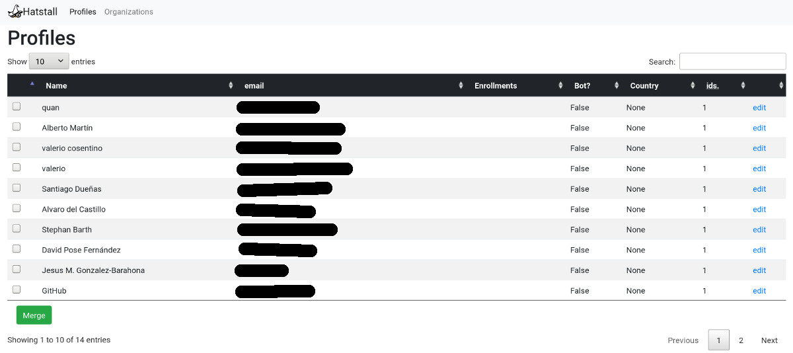
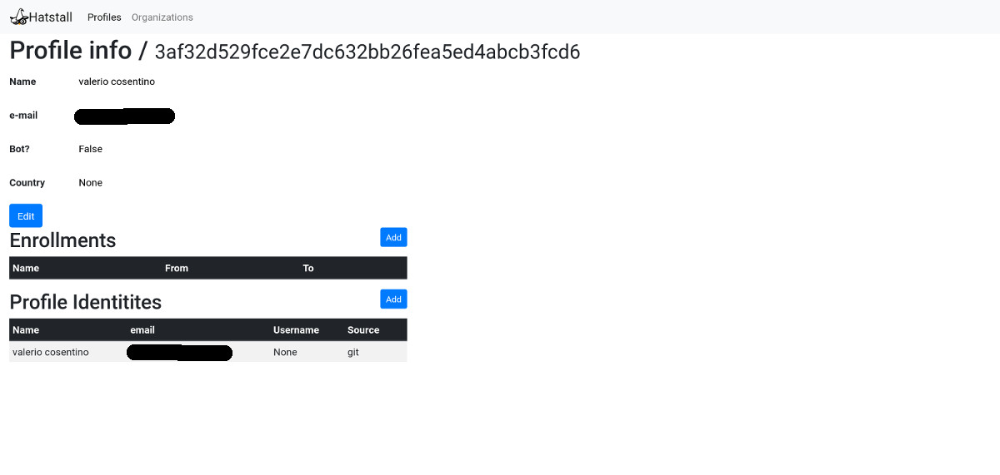
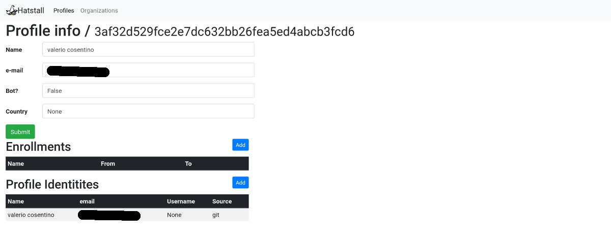

# Introduction

Managing community members profiles data can be very tedious:
* merging different profiles under a single one
* enroll a person to the right organization

There are already existing solutions, like `Jonathan Corbet's gitdm`, the current *SortingHat profiles update* solution based on providing a `.yml` file of the updates to be introduced, or even direct access to SortingHat database that are not perfect. For example:
* `gitdm` is focused in git related information, and *community* members go beyond coding
* current SortingHat solutions are not very *human friendly*, and the learning curve might be very high

So, I started working on a *PoC (Proof of Concept)* of a web UI to manage these processes by the community manager. This is how **Hatstall** started.

**Hatstall** is a web UI to manage part of [SortingHat](https://github.com/grimoirelab) data. 

The technologies involved are:
* For the backend:
  * [Flask](http://flask.pocoo.org/) as main framework
  * [SortingHat](https://github.com/grimoirelab/sortinghat/) to access to community profiles data (basically using [SortingHat API](https://github.com/grimoirelab/sortinghat/blob/master/sortinghat/api.py))
* For the front-end:
  * [Bootstrap](http://getbootstrap.com/) as main UI framework, and some extra plugins like [Bootstrap Datepicker](https://github.com/uxsolutions/bootstrap-datepicker/)
  * [DataTables JQuery plug-in](https://datatables.net/) to *search* and *order* data.

## Understanding SortingHat database

SortingHat stores and manages data about *community members*.

Community members are identified by the *identities* they are using in the different data sources (*git*, *github*, *bugzilla*, *slack*, etc.).

By default, each *identity* defines a *unique identity profile*. SortingHat is able to merge different *profiles* under a single one.

SortingHat is also able to manage community member *enrollments* information.

# Managing community profiles

`Profiles` page lists community profiles:

Profiles list page shows every profile existing in the SortingHat database, showing for each community member information like:
* profile name
* profile email
* organizations where the member has been enrolled
* boolean to check if member is a bot or not
* profile country
* number of different identities used by the profile in the project

User is able to merge already existing profiles using `Merge` button.

The `edit` link allows Hatstall's user to see and manage unique profile info:

The `Edit` button allows Hatstall's user to modify profile main information:

Using **Enrollments** `Add` button, the user is able to *enroll* the profile to existing organizations in the database:

It's also possible to *un-enroll* a profile from an organization.

*Still under-development*: User *shall* be able to edit enrollment initial and final date.

Using **Profile Identities** `Add` it's possible to add identities to the profile from the list of existing ones:

# Managing organizations

`Organizations` link shows a list of existing organizations:

It's possible to add new organizations to the database:

*Under development*: User *shall* be able to add and edit  organizations' *domains*.